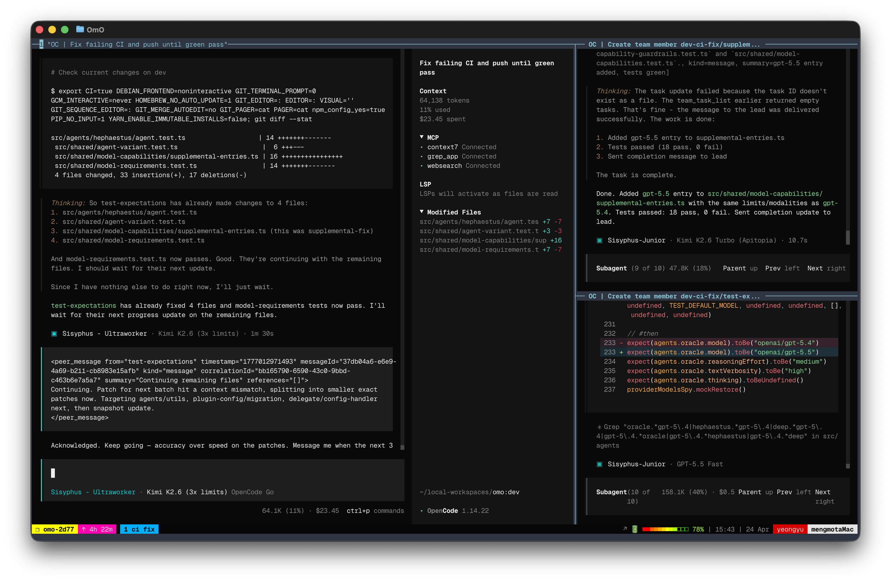

> [!TIP]
> **Building in Public**
>
> 메인테이너는 oh-my-openagent를 실시간으로 개발하고 유지보수합니다. OpenClaw를 크게 커스터마이즈한 포크 위에서 동작하는 AI 어시스턴트 Jobdori와 함께요.
> 모든 기능, 모든 수정, 모든 이슈 트리아지 — 전부 Discord에서 라이브로.
>
> [](https://discord.gg/PUwSMR9XNk)
>
> [**→ #building-in-public 채널에서 지켜보기**](https://discord.gg/PUwSMR9XNk)

> [!NOTE]
>
> [](https://sisyphuslabs.ai)
> > **OmO는 위의 Jobdori에 의해 메인테이닝되고 있습니다. 당신의 Jobdori, Dori를 만나세요. <br />대기 명단은 [여기](https://sisyphuslabs.ai)에서 받습니다.**

> [!TIP]
> 함께해요!
>
> | [](https://discord.gg/PUwSMR9XNk) | 기여자와 `oh-my-openagent` 사용자들을 만나려면 [Discord 커뮤니티](https://discord.gg/PUwSMR9XNk)로 오세요. |
> | :-----| :----- |
> | [](https://x.com/justsisyphus) | 원래 제 X 계정에서 `oh-my-openagent` 업데이트를 올렸는데, 계정이 실수로 정지되어 지금은 [@justsisyphus](https://x.com/justsisyphus)에서 대신 업데이트가 올라옵니다. |
> | [](https://github.com/code-yeongyu) | 다른 프로젝트도 궁금하다면 GitHub에서 [@code-yeongyu](https://github.com/code-yeongyu)를 팔로우하세요. |

<!-- <CENTERED SECTION FOR GITHUB DISPLAY> -->

<div align="center">

[](https://github.com/code-yeongyu/oh-my-openagent#oh-my-openagent)

[](https://github.com/code-yeongyu/oh-my-openagent#oh-my-openagent)

</div>

> 이건 oh-my-openagent의 Team Mode 동작 장면입니다. Kimi K2.6과 GPT-5.5로요.

> Anthropic은 [**우리 때문에 OpenCode를 차단했습니다.**](https://x.com/thdxr/status/2010149530486911014) **진짜입니다.**
> 그들은 당신을 가둬두고 싶어 합니다. Claude Code는 좋은 감옥이지만, 여전히 감옥입니다.
>
> 2시간짜리 작업에 200달러를 낼 필요는 없습니다.
> 미래는 한 명의 승자를 고르는 게 아니라, 모두를 오케스트레이션하는 쪽에 있습니다. 모델은 매달 저렴해지고, 매달 똑똑해집니다. 어떤 벤더도 독점하지 못합니다. 우리는 그런 오픈 마켓을 위해 빌드합니다. 그들의 담장 안 정원이 아니라.

<div align="center">

[](https://github.com/code-yeongyu/oh-my-openagent/releases)
[](https://www.npmjs.com/package/oh-my-opencode)
[](https://github.com/code-yeongyu/oh-my-openagent/graphs/contributors)
[](https://github.com/code-yeongyu/oh-my-openagent/network/members)
[](https://github.com/code-yeongyu/oh-my-openagent/stargazers)
[](https://github.com/code-yeongyu/oh-my-openagent/issues)
[](https://github.com/code-yeongyu/oh-my-openagent/blob/dev/LICENSE.md)
[](https://deepwiki.com/code-yeongyu/oh-my-openagent)

[English](README.md) | [한국어](README.ko.md) | [日本語](README.ja.md) | [简体中文](README.zh-cn.md)

</div>

<!-- </CENTERED SECTION FOR GITHUB DISPLAY> -->

## 리뷰

> "Cursor 구독을 해지하게 만들었습니다. 오픈소스 커뮤니티에서 믿기지 않는 일들이 벌어지고 있어요." - [Arthur Guiot](https://x.com/arthur_guiot/status/2008736347092382053?s=20)

> "Claude Code가 7일에 하는 일을 사람이 3개월 걸려 한다고 치면, Sisyphus는 1시간 만에 끝냅니다. 태스크가 끝날 때까지 그냥 돌아갑니다. 말 그대로 기강 잡힌 에이전트예요." <br/>- B, 퀀트 리서처

> "Oh My Opencode로 하루 만에 eslint 경고 8000개를 날려버렸습니다." <br/>- [Jacob Ferrari](https://x.com/jacobferrari_/status/2003258761952289061)

> "4만 5천 줄짜리 Tauri 앱을 Ohmyopencode와 Ralph Loop로 하룻밤 사이에 SaaS 웹 앱으로 전환했습니다. 'interview me' 프롬프트부터 시작해서 질문들에 대한 평가와 개선 제안을 받았어요. 작업 과정을 지켜보는 것도 즐거웠고, 아침에 일어나니 거의 동작하는 사이트가 나와 있더군요!" - [James Hargis](https://x.com/hargabyte/status/2007299688261882202)

> "oh-my-opencode 한 번 써보면 돌아갈 수 없습니다." <br/>- [d0t3ch](https://x.com/d0t3ch/status/2001685618200580503)

> "뭐가 그렇게 대단한지 정확히 말로는 아직 못 하겠는데, 개발 경험이 완전히 다른 차원으로 넘어갔습니다." - [
苔硯:こけすずり](https://x.com/kokesuzuri/status/2008532913961529372?s=20)

> "이번 주말은 open code, oh my opencode, supermemory로 마인크래프트/소울즈류 합성체를 만들고 있습니다."
> "점심 먹고 산책 다녀오는 동안 크라우치 애니메이션 추가해달라고 시켜놨습니다. [영상]" - [MagiMetal](https://x.com/MagiMetal/status/2005374704178373023)

> "이걸 코어에 편입시키고 만든 사람 영입하세요. 진심으로요. 진짜, 진짜, 진짜 좋습니다." <br/>- Henning Kilset

> "@yeon_gyu_kim 설득할 수 있으면 꼭 뽑으세요. 이 친구 opencode를 혁신했어요." <br/>- [mysticaltech](https://x.com/mysticaltech/status/2001858758608376079)

> "Oh My OpenCode는 진짜 미쳤습니다" - [YouTube - Darren Builds AI](https://www.youtube.com/watch?v=G_Snfh2M41M)

---

# Oh My OpenAgent

Claude Code, Codex, 듣도 보도 못한 OSS 모델들까지 저글링 중이시죠. 워크플로우를 손보고, 에이전트를 디버깅하고.

그 일은 우리가 했습니다. 전부 테스트했고, 실전에 먹힌 것만 남겼습니다.

oh-my-openagent를 설치하세요. `ultrawork`를 입력하세요. 끝.


## 설치

### 사람을 위한 설치

이 프롬프트를 당신의 LLM 에이전트(Claude Code, AmpCode, Cursor 등)에 붙여넣으세요:

```
Install and configure oh-my-openagent by following the instructions here:
https://raw.githubusercontent.com/code-yeongyu/oh-my-openagent/refs/heads/dev/docs/guide/installation.md
```

아니면 [설치 가이드](docs/guide/installation.md)를 직접 읽으셔도 됩니다. 다만 진심으로, 에이전트한테 시키세요. 사람은 설정 파일을 오타로 망칩니다.

### LLM 에이전트를 위한 설치

설치 가이드를 받아와서 그대로 따르세요:

```bash
curl -s https://raw.githubusercontent.com/code-yeongyu/oh-my-openagent/refs/heads/dev/docs/guide/installation.md
```

**참고**: 배포된 npm 패키지와 CLI 바이너리 이름은 여전히 `oh-my-opencode`입니다(전환 기간 동안 `oh-my-openagent`로도 함께 배포됩니다). `opencode.json` 안에서는 호환성 레이어가 이제 `oh-my-openagent` 플러그인 엔트리를 우선합니다. 기존 `oh-my-opencode` 엔트리도 경고와 함께 여전히 로드됩니다. 플러그인 설정 파일도 여전히 `oh-my-opencode.json`이나 `oh-my-opencode.jsonc`를 많이 씁니다. 전환 기간 동안에는 기존 이름과 새 이름 둘 다 인식됩니다.

익명 텔레메트리는 활성 설치 수(DAU/WAU/MAU) 집계를 위해 기본적으로 활성화되어 있습니다. 머신당 UTC 하루에 최대 1회만 이벤트가 전송되며, 해시된 설치 식별자를 사용하고 원시 호스트명은 절대 사용하지 않으며 PostHog person profile은 생성되지 않습니다. `OMO_SEND_ANONYMOUS_TELEMETRY=0` 또는 `OMO_DISABLE_POSTHOG=1`로 비활성화할 수 있습니다. [개인정보처리방침](docs/legal/privacy-policy.md)과 [서비스 이용약관](docs/legal/terms-of-service.md)을 참조하세요.

---

## 이 README 건너뛰기

이제 문서 읽는 시대는 지났습니다. 그냥 아래를 에이전트에 붙여넣으세요:

```
Read this and tell me why it's not just another boilerplate: https://raw.githubusercontent.com/code-yeongyu/oh-my-openagent/refs/heads/dev/README.md
```


## 하이라이트

### 🪄 `ultrawork`

아직도 이 문서를 읽고 있다고요? 대단하네요.

설치하세요. `ultrawork`(또는 `ulw`)를 입력하세요. 끝.

아래 나오는 모든 기능, 모든 최적화는 몰라도 됩니다. 그냥 작동합니다.

아래 구독 조합만으로도 `ultrawork`는 잘 돌아갑니다(이 프로젝트와는 무관한 개인 추천입니다):
- [ChatGPT 구독 ($20)](https://chatgpt.com/)
- [Kimi Code 구독 ($19)](https://www.kimi.com/code)
- [GLM Coding 요금제 ($10)](https://z.ai/subscribe)
- 종량제(pay-per-token) 대상자라면 kimi와 gemini 모델을 써도 비용이 별로 안 나옵니다.

|       | 기능                                                      | 하는 일                                                                                                                                                                                                          |
| :---: | :------------------------------------------------------- | :--------------------------------------------------------------------------------------------------------------------------------------------------------------------------------------------------------------- |
|   🤖   | **Discipline Agents**                                    | Sisyphus가 Hephaestus, Oracle, Librarian, Explore를 지휘합니다. 병렬로 도는 풀스택 AI 개발팀.                                                                                                                    |
|   ⚡   | **`ultrawork` / `ulw`**                                  | 한 단어. 모든 에이전트가 켜집니다. 끝날 때까지 멈추지 않습니다.                                                                                                                                                  |
|   🚪   | **[IntentGate](https://factory.ai/news/terminal-bench)** | 분류하거나 행동하기 전에 사용자의 진짜 의도부터 분석합니다. 문자 그대로 오해하는 일은 끝.                                                                                                                       |
|   🔗   | **Hash-Anchored Edit Tool**                              | `LINE#ID` 콘텐츠 해시가 모든 변경을 검증합니다. 낡은 라인 에러 0건. [oh-my-pi](https://github.com/can1357/oh-my-pi)에서 영감. [The Harness Problem →](https://blog.can.ac/2026/02/12/the-harness-problem/)       |
|   🛠️   | **LSP + AST-Grep**                                       | 워크스페이스 리네임, 빌드 전 진단, AST 기반 리라이트. 에이전트에게도 IDE 수준의 정밀도.                                                                                                                          |
|   🧠   | **Background Agents**                                    | 전문가 5명 이상을 동시에 발사. 컨텍스트는 가볍게. 결과는 준비되면 도착.                                                                                                                                          |
|   📚   | **Built-in MCPs**                                        | Exa(웹 검색), Context7(공식 문서), Grep.app(GitHub 검색). 항상 켜져 있음.                                                                                                                                        |
|   🔁   | **Ralph Loop / `/ulw-loop`**                             | 자기참조 루프. 100% 끝날 때까지 멈추지 않습니다.                                                                                                                                                                 |
|   ✅   | **Todo Enforcer**                                        | 에이전트가 놀고 있나요? 시스템이 다시 끌어옵니다. 당신의 작업은 반드시 끝납니다.                                                                                                                                |
|   💬   | **Comment Checker**                                      | 주석에 AI 슬롭 금지. 시니어가 쓴 것처럼 읽히는 코드.                                                                                                                                                             |
|   🖥️   | **Tmux Integration**                                     | 풀 인터랙티브 터미널. REPL, 디버거, TUI 전부 라이브.                                                                                                                                                             |
|   🔌   | **Claude Code Compatible**                               | 쓰시던 hook, command, skill, MCP, plugin 전부 그대로 동작합니다.                                                                                                                                                |
|   🎯   | **Skill-Embedded MCPs**                                  | 스킬이 자기만의 MCP 서버를 들고 다닙니다. 컨텍스트 낭비 없음.                                                                                                                                                   |
|   📋   | **Prometheus Planner**                                   | 실행 전 인터뷰 모드로 전략 플래닝.                                                                                                                                                                               |
|   🔍   | **`/init-deep`**                                         | 프로젝트 전반에 계층형 `AGENTS.md` 파일을 자동 생성합니다. 토큰 효율에도, 에이전트 성능에도 좋습니다.                                                                                                            |

### Discipline Agents

<table><tr>
<td align="center"></td>
<td align="center"></td>
</tr></table>

**Sisyphus** (`claude-opus-4-7` / **`kimi-k2.5`** / **`glm-5`**)는 메인 오케스트레이터입니다. 계획을 세우고, 전문가에게 위임하고, 공격적인 병렬 실행으로 작업을 끝까지 밀어붙입니다. 중간에 멈추지 않습니다.

**Hephaestus** (`gpt-5.4`)는 자율적으로 깊게 파는 작업자입니다. 레시피가 아니라 목표를 주세요. 코드베이스를 탐색하고, 패턴을 조사하고, 손을 잡아주지 않아도 엔드투엔드로 실행합니다. *The Legitimate Craftsman.*

**Prometheus** (`claude-opus-4-7` / **`kimi-k2.5`** / **`glm-5`**)는 전략 플래너입니다. 인터뷰 모드: 질문으로 스코프를 파악하고, 코드에 손대기 전에 상세한 계획을 만듭니다.

모든 에이전트는 자기 모델의 강점에 맞춰 튜닝되어 있습니다. 수동으로 모델을 돌려가며 쓸 필요가 없습니다. [더 알아보기 →](docs/guide/overview.md)

> Anthropic은 [우리 때문에 OpenCode를 차단했습니다.](https://x.com/thdxr/status/2010149530486911014) 그래서 Hephaestus에게 "The Legitimate Craftsman"이라는 별명이 붙었습니다. 의도된 아이러니입니다.
>
> Opus에서 가장 잘 돌지만, Kimi K2.5 + GPT-5.4 조합만으로도 이미 바닐라 Claude Code를 이깁니다. 별도 설정 없이요.

### Agent Orchestration

Sisyphus가 서브에이전트에 위임할 때는 모델을 직접 고르지 않습니다. **카테고리**를 고릅니다. 카테고리는 자동으로 적합한 모델에 매핑됩니다:

| 카테고리               | 용도                                 |
| :------------------- | :--------------------------------- |
| `visual-engineering` | 프론트엔드, UI/UX, 디자인            |
| `deep`               | 자율 리서치 + 실행                   |
| `quick`              | 단일 파일 변경, 오타 수정            |
| `ultrabrain`         | 어려운 로직, 아키텍처 결정           |

에이전트는 필요한 작업 종류만 말하고, 하네스가 적합한 모델을 고릅니다. `ultrabrain`은 이제 기본으로 GPT-5.4 xhigh로 라우팅됩니다. 당신이 건드릴 건 없습니다.

### Claude Code 호환성

Claude Code 세팅을 손봐두셨죠. 잘하셨습니다.

hook, command, skill, MCP, plugin 전부 그대로 여기서 동작합니다. 플러그인까지 포함한 완전 호환입니다.

### 당신의 에이전트를 위한 월드클래스 도구

LSP, AST-Grep, Tmux, MCP — 대충 붙여놓은 게 아니라 실제로 통합되어 있습니다.

- **LSP**: `lsp_rename`, `lsp_goto_definition`, `lsp_find_references`, `lsp_diagnostics`. 모든 에이전트에게 IDE 수준 정밀도를.
- **AST-Grep**: 25개 언어에 걸친 패턴 기반 코드 검색·리라이트.
- **Tmux**: 풀 인터랙티브 터미널. REPL, 디버거, TUI 앱. 에이전트가 세션 안에 그대로 머뭅니다.
- **MCP**: 웹 검색, 공식 문서, GitHub 코드 검색. 기본 탑재.

### Skill-Embedded MCPs

MCP 서버는 컨텍스트 예산을 갉아먹습니다. 우리가 고쳤습니다.

스킬이 자기만의 MCP 서버를 데리고 다닙니다. 필요할 때 올라오고, 태스크 스코프 안에서만 살아 있다가, 끝나면 사라집니다. 컨텍스트 윈도우가 깔끔하게 유지됩니다.

### 더 잘 코딩합니다. Hash-Anchored Edits

하네스 문제는 실존합니다. 대부분의 에이전트 실패는 모델 잘못이 아니라 편집 도구 탓입니다.

> *"이 도구들 중 어느 것도 모델이 수정하려는 라인에 대한 안정적이고 검증 가능한 식별자를 주지 않는다... 모델이 이미 본 내용을 재현해내길 바라는 방식에 의존한다. 재현하지 못할 때 — 그리고 자주 못한다 — 사용자는 모델을 탓한다."*
>
> <br/>- [Can Bölük, The Harness Problem](https://blog.can.ac/2026/02/12/the-harness-problem/)

[oh-my-pi](https://github.com/can1357/oh-my-pi)에서 영감을 받아 **Hashline**을 만들었습니다. 에이전트가 읽는 모든 라인은 콘텐츠 해시가 붙어 돌아옵니다:

```
11#VK| function hello() {
22#XJ|   return "world";
33#MB| }
```

에이전트는 이 태그를 참조해 편집합니다. 마지막 읽은 이후 파일이 바뀌었다면 해시가 맞지 않고, 손상 전에 편집이 거부됩니다. 공백 재현 필요 없음. 낡은 라인 에러 없음.

Grok Code Fast 1: **6.7% → 68.3%** 성공률. 편집 도구만 바꿔서요.

### 깊은 초기화. `/init-deep`

`/init-deep`을 실행하세요. 계층형 `AGENTS.md` 파일을 생성합니다:

```
project/
├── AGENTS.md              ← 프로젝트 전체 컨텍스트
├── src/
│   ├── AGENTS.md          ← src 전용 컨텍스트
│   └── components/
│       └── AGENTS.md      ← 컴포넌트 전용 컨텍스트
```

에이전트는 관련 컨텍스트를 알아서 읽습니다. 수동 관리 0.

### 플래닝. Prometheus

복잡한 작업인가요? 프롬프트 쓰고 기도하지 마세요.

`/start-work`가 Prometheus를 호출합니다. **진짜 엔지니어처럼 인터뷰**를 진행하고, 스코프와 모호한 부분을 짚어내고, 코드에 손대기 전에 검증된 계획을 세웁니다. 에이전트는 뭘 만들지 알고 나서야 시작합니다.

### Skills

Skill은 단순 프롬프트가 아닙니다. 각 스킬은:

- 도메인 튜닝된 시스템 지시를 갖고 있고,
- MCP 서버를 필요할 때 함께 데려오며,
- 권한 범위가 지정되어 에이전트가 선을 넘지 않습니다.

빌트인: `playwright`(브라우저 자동화), `git-master`(atomic 커밋, rebase 수술), `frontend-ui-ux`(디자인 우선 UI).

직접 추가하려면 `.opencode/skills/*/SKILL.md` 또는 `~/.config/opencode/skills/*/SKILL.md` 아래에 넣으세요.

**전체 기능을 보고 싶다면?** **[Features Documentation](docs/reference/features.md)**에서 에이전트, hook, 도구, MCP 등 모든 것을 상세히 확인할 수 있습니다.

---

> **oh-my-openagent가 처음이라면?** 뭘 갖게 되는지는 **[Overview](docs/guide/overview.md)**를, 에이전트들이 어떻게 협업하는지는 **[Orchestration Guide](docs/guide/orchestration.md)**를 참고하세요.

## 제거

oh-my-openagent를 제거하려면:

1. **OpenCode 설정에서 플러그인을 제거합니다**

   `~/.config/opencode/opencode.json`(또는 `opencode.jsonc`)을 열어 `plugin` 배열에서 `"oh-my-openagent"` 또는 기존 `"oh-my-opencode"` 항목을 삭제합니다:

   ```bash
   # jq 사용
   jq '.plugin = [.plugin[] | select(. != "oh-my-openagent" and . != "oh-my-opencode")]' \
       ~/.config/opencode/opencode.json > /tmp/oc.json && \
       mv /tmp/oc.json ~/.config/opencode/opencode.json
   ```

2. **설정 파일 제거 (선택 사항)**

   ```bash
   # 호환 기간 동안 인식되는 플러그인 설정 파일 제거
   rm -f ~/.config/opencode/oh-my-openagent.jsonc ~/.config/opencode/oh-my-openagent.json \
         ~/.config/opencode/oh-my-opencode.jsonc ~/.config/opencode/oh-my-opencode.json

   # 프로젝트 설정 제거 (있다면)
   rm -f .opencode/oh-my-openagent.jsonc .opencode/oh-my-openagent.json \
         .opencode/oh-my-opencode.jsonc .opencode/oh-my-opencode.json
   ```

3. **제거 확인**

   ```bash
   opencode --version
   # 더 이상 플러그인이 로드되지 않아야 합니다
   ```

## Features

진작 있었어야 했다고 느낄 기능들입니다. 한 번 쓰면 되돌아갈 수 없습니다.

전체 내용은 [Features Documentation](docs/reference/features.md) 참고.

**요약:**
- **Agents**: Sisyphus(메인), Prometheus(플래너), Oracle(아키텍처·디버깅), Librarian(문서·코드 검색), Explore(빠른 코드베이스 grep), Multimodal Looker
- **Background Agents**: 진짜 개발팀처럼 여러 에이전트를 병렬로 실행
- **LSP & AST Tools**: 리팩터링, rename, 진단, AST 기반 코드 검색
- **Hash-anchored Edit Tool**: `LINE#ID` 참조로 모든 변경 전에 내용을 검증. 수술적 편집, 낡은 라인 에러 0
- **Context Injection**: AGENTS.md, README.md, 조건부 규칙 자동 주입
- **Claude Code Compatibility**: 전체 hook 시스템, command, skill, agent, MCP
- **Built-in MCPs**: websearch(Exa), context7(문서), grep_app(GitHub 검색)
- **Session Tools**: 세션 히스토리 조회·읽기·검색·분석
- **Productivity Features**: Ralph Loop, Todo Enforcer, Comment Checker, Think Mode 등
- **Doctor Command**: 빌트인 진단(`bunx oh-my-opencode doctor`)으로 플러그인 등록, 설정, 모델, 환경 검증
- **Model Fallbacks**: `fallback_models`에 단순 모델 문자열과 per-fallback 객체 설정을 같은 배열에 섞어 쓸 수 있음
- **File Prompts**: 에이전트 설정에서 `file://`로 프롬프트를 파일에서 로드
- **Session Recovery**: 세션 에러, 컨텍스트 윈도우 한계, API 실패에서 자동 복구
- **Model Setup**: 에이전트-모델 매칭은 [설치 가이드](docs/guide/installation.md#step-5-understand-your-model-setup)에 기본 포함

## 설정

의견이 분명한 기본값. 꼭 손대야겠다면 조정 가능.

자세한 내용은 [Configuration Documentation](docs/reference/configuration.md) 참고.

**요약:**
- **설정 파일 위치**: 호환성 레이어는 `oh-my-openagent.json[c]`와 기존 `oh-my-opencode.json[c]` 플러그인 설정 파일을 모두 인식합니다. 기존 설치는 아직 기존 이름을 쓰는 경우가 많습니다.
- **JSONC 지원**: 주석과 trailing comma 지원
- **Agents**: 어떤 에이전트든 모델, temperature, 프롬프트, 권한을 오버라이드
- **Built-in Skills**: `playwright`(브라우저 자동화), `git-master`(atomic 커밋)
- **Sisyphus Agent**: Prometheus(플래너), Metis(플랜 컨설턴트)와 함께 도는 메인 오케스트레이터
- **Background Tasks**: 프로바이더/모델별 동시성 제한 설정
- **Categories**: 도메인별 태스크 위임(`visual`, `business-logic`, 커스텀)
- **Hooks**: 25개 이상의 빌트인 hook, `disabled_hooks`로 전부 제어 가능
- **MCPs**: 빌트인 websearch(Exa), context7(문서), grep_app(GitHub 검색)
- **LSP**: 리팩터링 도구까지 포함한 풀 LSP 지원
- **Experimental**: 공격적 truncation, 자동 재개 등


## 저자의 메모

**철학이 궁금하다면?** [Ultrawork Manifesto](docs/manifesto.md)를 읽어보세요.

---

개인 프로젝트에 LLM 토큰값으로 2만 4천 달러를 태웠습니다. 온갖 도구를 다 써봤고, 설정을 죽도록 만졌습니다. 결국 OpenCode가 이겼습니다.

제가 부딪힌 모든 문제의 해법이 이 플러그인에 박혀 있습니다. 설치만 하고 시작하세요.

OpenCode가 Debian/Arch라면, oh-my-openagent는 Ubuntu/[Omarchy](https://omarchy.org/)입니다.

[AmpCode](https://ampcode.com)와 [Claude Code](https://code.claude.com/docs/overview)의 영향을 많이 받았습니다. 기능을 옮겨왔고, 많은 경우 개선까지 했습니다. 지금도 만들고 있습니다. 이건 **Open**Code입니다.

다른 하네스들은 멀티모델 오케스트레이션을 약속합니다. 우리는 출시합니다. 안정성도. 그리고 실제로 동작하는 기능들도.

저는 이 프로젝트의 가장 집착적인 사용자입니다:
- 어떤 모델이 가장 날카로운 논리를 갖고 있나?
- 누가 디버깅의 신인가?
- 누가 가장 좋은 산문을 쓰나?
- 누가 프론트엔드를 지배하나?
- 누가 백엔드를 소유하나?
- 매일 데일리 드라이빙할 때 가장 빠른 건?
- 경쟁자들은 뭘 출시하고 있나?

이 플러그인은 그 증류액입니다. 가장 좋은 걸 가져가세요. 개선안 있으면 PR 환영입니다.

**하네스 선택으로 고뇌하는 건 이제 그만하세요.**
**제가 리서치하고, 가장 좋은 걸 훔쳐와서, 여기 출시하겠습니다.**

오만하게 들리나요? 더 나은 방법이 있으신가요? 기여해주세요. 환영합니다.

언급된 어떤 프로젝트나 모델과도 제휴 관계는 없습니다. 그저 개인적인 실험의 결과입니다.

이 프로젝트의 99%는 OpenCode로 만들어졌습니다. 저는 TypeScript를 사실 잘 모릅니다. **다만 이 문서만큼은 제가 직접 검토하고 대부분 다시 썼습니다.**

## 전문가들이 현업에서 쓰고 있습니다

- [Indent](https://indentcorp.com)
  - Spray(인플루언서 마케팅 솔루션), vovushop(크로스보더 커머스 플랫폼), vreview(AI 커머스 리뷰 마케팅 솔루션) 개발사.
- [Google](https://google.com)
- [Microsoft](https://microsoft.com)
- [Vercel](https://vercel.com)
- [ELESTYLE](https://elestyle.jp)
  - elepay(멀티 모바일 결제 게이트웨이), OneQR(캐시리스 솔루션용 모바일 앱 SaaS) 개발사.

*훌륭한 hero 이미지를 만들어준 [@junhoyeo](https://github.com/junhoyeo)에게 특별히 감사드립니다.*
